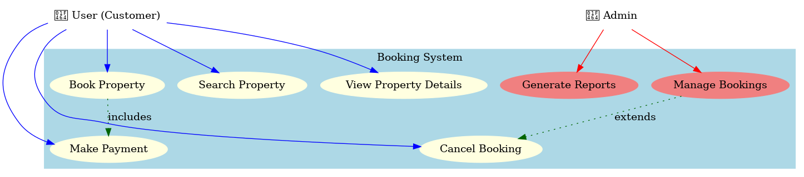

# Requirement Analysis in Software Development

## Introduction

This repository explores the concept of **Requirement Analysis**, its importance in the software development lifecycle (SDLC), and the key activities and deliverables involved. The goal is to provide a comprehensive guide to understanding how to define, gather, document, and validate requirements effectively.

---

## What is Requirement Analysis?

**Requirement Analysis** is the process of identifying, gathering, and documenting the needs and expectations of stakeholders for a software project. It is a critical phase in the software development lifecycle that ensures all requirements are clear, feasible, and aligned with the project's objectives.

### Importance of Requirement Analysis in SDLC:

- **Improved Project Clarity**: Helps avoid ambiguity by clearly defining the project's goals and deliverables.
- **Efficient Resource Allocation**: Ensures the proper allocation of resources, time, and budget.
- **Minimized Risks**: Reduces the likelihood of project scope creep and miscommunication among stakeholders.

---

## Why is Requirement Analysis Important?

Requirement Analysis is critical in the SDLC for several reasons:

1. **Clarity and Understanding**:
   - Provides a clear understanding of stakeholder expectations and reduces ambiguity.
2. **Scope Definition**:
   - Clearly defines the project scope, preventing scope creep and ensuring project deliverables remain aligned with objectives.
3. **Cost and Time Estimation**:

   - Helps in estimating project cost, time, and resources accurately, leading to efficient planning.

4. **Quality Assurance**:
   - Ensures the final product meets the defined requirements, resulting in higher customer satisfaction.

---

## Key Activities in Requirement Analysis

Requirement Analysis involves five key activities:

- **Requirement Gathering**:

  - Techniques include interviews, surveys, workshops, observation, and document analysis to collect stakeholder requirements.

- **Requirement Elicitation**:

  - Refining gathered requirements using methods like brainstorming, focus groups, and prototyping.

- **Requirement Documentation**:

  - Documenting functional and non-functional requirements through specification documents, user stories, and use cases.

- **Requirement Analysis and Modeling**:

  - Using models (e.g., data flow diagrams, ER diagrams) to visualize requirements and performing feasibility and prioritization assessments.

- **Requirement Validation**:
  - Reviewing and validating requirements with stakeholders to ensure they are accurate, complete, and feasible.

---

## Types of Requirements

### Functional Requirements:

These describe what the system should do. For a booking management project:

- Example 1: Users can search for available properties by location and date.
- Example 2: Users can register and log in securely.

### Non-functional Requirements:

These define the quality attributes of the system. For a booking management project:

- Example 1: The website should load within 2 seconds.
- Example 2: The system must support up to 10,000 concurrent users.

---

## Use Case Diagrams

**Use Case Diagrams** illustrate the interactions between users (actors) and the system. They help stakeholders visualize system functionalities and their relationships.

### Benefits of Use Case Diagrams:

- Clarify user interactions and system boundaries.
- Simplify communication between stakeholders and developers.

**Example Diagram for a Booking System**:  

---

## Acceptance Criteria

**Acceptance Criteria** define the conditions a feature must meet to be accepted by stakeholders. They ensure clarity, alignment, and quality.

### Importance of Acceptance Criteria:

- Provides a clear standard for feature completion.
- Reduces miscommunication and ensures all parties agree on requirements.

### Example:

**Feature**: Checkout Process

- **Acceptance Criteria**:
  - Users can review their booking details before confirming.
  - Users can securely make payments using multiple payment methods.
  - A confirmation email is sent to the user upon successful checkout.

---
